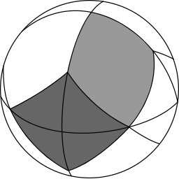

# Rust_moc_gui

## Goal
The goal of this project is to create a gui in Rust using [egui]("https://crates.io/crates/egui") to make different operations on MOCs.

## Usage
The user must first choose wether he wants to do the operation on 1 or 2 mocs, after that he can choose the type of MOC.
Then he can add 1 or more files to read data from.
Once these files have been imported 1 or 2 comboboxes will appear, the user can choose which file to operate on.
Once this has been done the user can choose the input and simply launch the operation.

By default the application will choose 1 MOC operation, with space MOCs and will output using the ivoa fits standard.

## Features
- [X] Allows the user to choose different files containing a MOC
- [X] The user can launch an operation on a MOC
- [X] The user can launch an operation between 2 MOCs
- [X] All 1 moc operation are implemented
- [X] All 2 moc opertaions are implemented
- [X] The user can import space, time and spacetime MOCs
- [X] The user can choose the type of output
